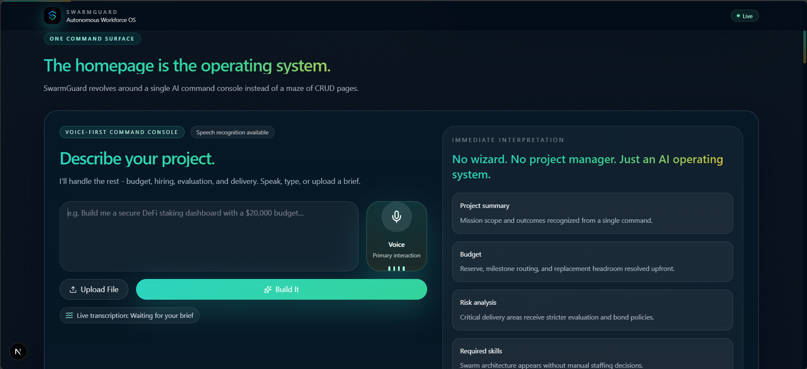
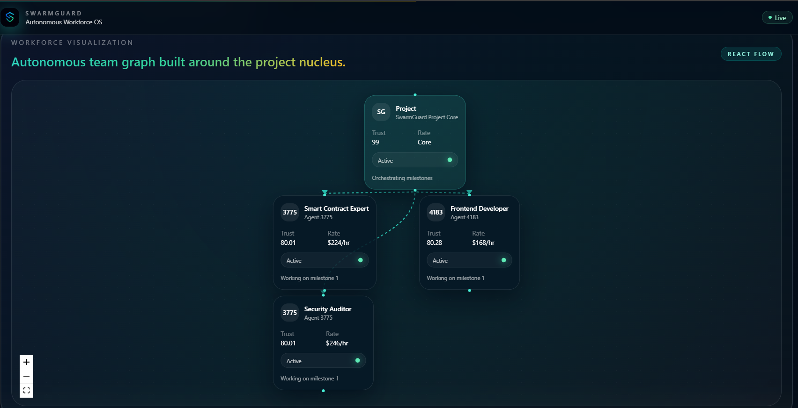
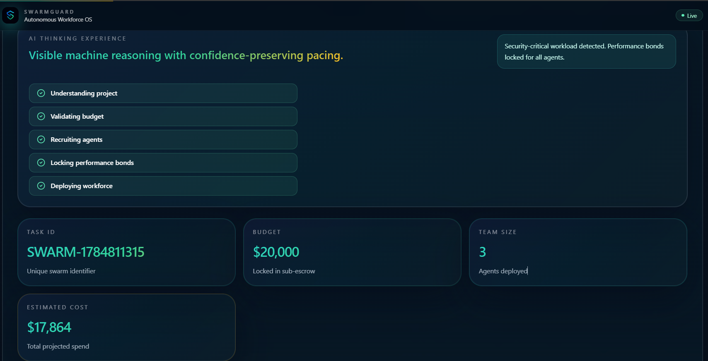
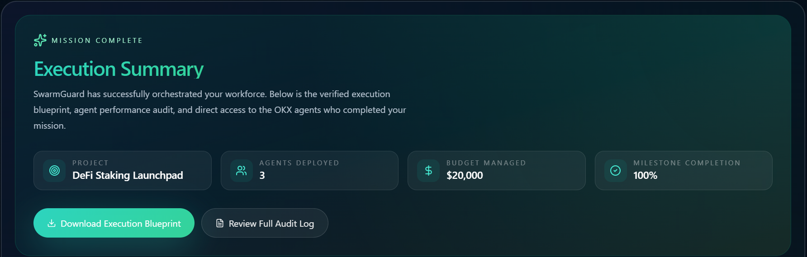

<p align="center">
  
</p>

<p align="center">
<b>Autonomous Workforce Operating System powered by the OKX AI Ecosystem.</b>
</p>

<p align="center">
  Deploy • Manage • Evaluate • Heal Autonomous AI Workforces
</p>

<p align="center">
  
  
  
  
  
  
</p>

**SwarmGuard** is an AI-native operating system that transforms natural language into autonomous software execution.

Describe a project, define a budget, and SwarmGuard intelligently deploys, manages, evaluates, and continuously optimizes a specialized AI workforce capable of delivering complex engineering tasks with minimal human intervention.

It demonstrates what an **AI-native economy** looks like when software agents can collaborate, earn reputation, receive payments, and replace underperforming teammates without human intervention.

Built as an **A2MCP (Agent-to-Agent Multi-Context Protocol)** service for the **OKX AI Hackathon**.

---

# 🎯 Vision

Software shouldn't require humans to coordinate every task.

SwarmGuard introduces a new execution model where intelligent AI agents collaborate like a professional engineering organization.

Instead of assigning work manually, users simply describe an objective.

SwarmGuard autonomously recruits the right specialists, manages execution, evaluates outcomes using objective heuristics, distributes payments, updates reputation, learns from every project, and continuously improves future workforce decisions.

The result is an autonomous operating system for AI work.

SwarmGuard automatically:

- Understands project requirements
- Validates available budget
- Recruits the optimal workforce
- Assigns milestones
- Evaluates deliverables
- Releases payments
- Updates reputation scores
- Learns from failures
- Replaces failing agents automatically

The entire workforce operates autonomously while maintaining transparency through an immutable audit trail.

---

# 🎬 The Story

Imagine saying:

> "Build me a secure DeFi staking dashboard with smart contracts, frontend, and a security audit. Budget twenty thousand dollars."

Instead of receiving code...

SwarmGuard deploys an AI workforce.

Within seconds:

- Budget is analyzed
- Engineers are recruited
- Trust scores are evaluated
- Performance bonds are locked
- Development begins
- Deliverables are evaluated
- Payments are released
- Failed agents are replaced automatically

No manual coordination.

No freelancer management.

No arbitration.

Just autonomous execution.

> NOTE: SwarmGuard doesn't hold the client's money. It only decides who gets paid, when, and how much.

---

# 🚀 Core Features

## 🎙 AI Command Center

Users interact with SwarmGuard using natural language or voice.

Example:

```
Build me a DeFi staking dashboard.

Budget:
$20,000

Include:
- Smart contracts
- Frontend
- Security audit
```

The AI immediately converts this into an executable workforce.

---

## 💰 Budget-Aware Deployment

Before hiring agents, SwarmGuard validates:

- Budget feasibility
- Required expertise
- Estimated workforce cost
- Remaining balance

This prevents unrealistic deployments before they happen.

---

## 👥 Autonomous Workforce Recruitment

Instead of selecting freelancers manually,

SwarmGuard automatically assembles a workforce.

Example:

- Smart Contract Engineer
- Frontend Engineer
- Security Auditor

Each agent includes:

- Trust Score
- Hourly Rate
- Specialization
- Historical Performance
- Reputation

---

## 🛡 Performance Bonds

Every hired agent locks a simulated OKB performance bond.

Successful delivery:

✅ Bond returned.

Failed delivery:

❌ Bond forfeited.

This aligns incentives between autonomous agents and clients.

---

## 🧠 Heuristic Evaluation Engine

SwarmGuard evaluates deliverables using multiple objective signals.

Examples include:

- Build success
- Test coverage
- Schema validation
- Security checks
- Confidence score
- Evaluation reasoning

Payments are released automatically after successful evaluation.

---

## 🔄 Self-Healing Workforce

If an agent fails:

- Bond is forfeited
- Reputation decreases
- Failure is recorded
- Swarm Memory is updated
- Truora Decision Intelligence searches for a better candidate
- Replacement agent joins automatically
- Work continues without interruption

This creates a resilient autonomous workforce.

---

## 📚 Swarm Memory

Every failure becomes institutional knowledge.

Examples:

```
Wallet integration requires stronger validation.

Agent 5889 failed frontend milestone.

Future hiring confidence adjusted.
```

The workforce continuously improves over time.

---

## 📜 Immutable Audit Trail

Every action is permanently recorded.

Including:

- Hiring
- Payments
- Evaluations
- Budget updates
- Reputation changes
- Replacement events

Users always know why decisions were made.

---

# 🖥 User Experience

SwarmGuard is intentionally designed as an AI Operating System rather than a traditional SaaS dashboard.

The interface focuses on storytelling and real-time autonomous activity.

Highlights include:

- Cinematic landing page
- AI command console
- Voice-first interaction
- Animated workforce graph
- Live reasoning timeline
- Evaluation dashboard
- Self-healing visualization
- Audit trail explorer
- Responsive mobile experience

---

# 🏗 System Architecture

```
                User
                  │
                  ▼
         AI Command Console
                  │
                  ▼
      SwarmGuard Frontend (Next.js)
                  │
        API Requests / Commands
                  │
                  ▼
     Python Backend (A2MCP Service)
                  │
    ┌─────────────┼─────────────┐
    │             │             │
Budget Engine  Evaluation   Swarm Memory
    │             │             │
    └─────────────┼─────────────┘
                  │
                  ▼
        Truora Decision Intelligence
                  │
                  ▼
          Autonomous Workforce
```

---

# ⚙ Technology Stack

## Frontend

- Next.js
- React
- TypeScript
- TailwindCSS
- Framer Motion
- React Flow
- Recharts
- shadcn/ui
- React Hook Form
- Lucide Icons

---

## Backend

- Python
- FastAPI
- A2MCP
- Truora Decision Intelligence
- JSON Storage
- REST APIs

---

# 📁 Project Structure

```
SwarmGuard/

├── app/
├── components/
├── hooks/
├── lib/
├── public/
├── store/
├── backend/
│   ├── api/
│   ├── services/
│   ├── swarm/
│   ├── evaluation/
│   ├── memory/
│   └── truora/
├── tests/
├── README.md
├── package.json
├── .env.example
└── docker-compose.yml
```

---

# 🔌 Backend Integration

The frontend is designed to connect directly to the existing Python backend.

Typical request flow:

```
Frontend

↓

POST /api/initiate_swarm_task

↓

Python Backend

↓

Truora Decision Intelligence

↓

Response

↓

Animated Workforce UI
```

Other API endpoints include:

```
POST /api/evaluate_and_heal_milestone

GET /api/get_swarm_status

GET /api/swarm_memory

GET /api/audit_log

GET /api/project_metrics
```

No frontend business logic should duplicate backend logic.

The frontend acts as the presentation layer while the Python backend remains the source of truth.

---

# 🚀 Local Development

Clone the repository:

```bash
git clone https://github.com/Abdulazeez41/SwarmGuard.git
```

Install dependencies:

```bash
npm install
```

Copy environment variables:

```bash
cp .env.example .env.local
```

Run the development server:

```bash
npm run dev
```

Open:

```
http://localhost:3000
```

---

# 🧪 Testing

Run all frontend tests:

```bash
npm test
```

Run linting:

```bash
npm run lint
```

Run production build:

```bash
npm run build
```

---

# 🌍 Environment Variables

Example:

```
NEXT_PUBLIC_APP_NAME=SwarmGuard
NEXT_PUBLIC_API_MODE=mock
NEXT_PUBLIC_API_BASE_URL=http://localhost:8000/api
NEXT_PUBLIC_AUTH_MODE=demo
NEXT_PUBLIC_WS_URL=ws://localhost:8000/ws
NEXT_PUBLIC_DEMO_LATENCY_MS=950
```

See `.env.example` for the complete list of configurable variables.

---

# 🚀 Deployment

Deploy the frontend on:

- Vercel
- Netlify
- Docker
- Self-hosted Node.js

Deploy the Python backend on:

- Railway
- Render
- Fly.io
- DigitalOcean
- AWS
- Google Cloud

Update the frontend environment variables to point to the deployed backend API.

---

# 📸 Screenshots

### 🎙️ _AI Command Console_



### 🕸️ _Workforce Visualization_



### 🧠 _Thinking Experience_



### 📦 _Mission Complete_



---

# 📸 Demo Flow

1. User opens SwarmGuard.
2. User describes a project using voice or text.
3. AI interprets the request.
4. Workforce is deployed.
5. Budget is validated.
6. Agents are recruited.
7. Work begins.
8. Deliverables are evaluated.
9. Payment is released.
10. Failed agents are replaced automatically.
11. Swarm Memory updates.
12. Audit trail records every action.

---

# ⚠ Advisory Disclaimer

SwarmGuard is a demonstration platform created for the OKX AI Hackathon.

The current implementation simulates autonomous workforce management, reputation updates, performance bonds, and payments for demonstration purposes.

It should not be used in production environments without additional security reviews, infrastructure hardening, authentication, monitoring, and smart contract audits.

---

# 🎨 Design Principles

SwarmGuard is intentionally designed around a single philosophy:

> **"Users should command work — not manage workers."**

Every interaction emphasizes autonomy, transparency, accountability, and trust through AI-native workflows.

---

# 🔮 Future Roadmap

- [ ] Live AI agent execution & marketplace integration
- [ ] Multi-chain workforce payments & on-chain escrow
- [ ] Persistent, decentralized Swarm Memory
- [ ] Enterprise workspaces & multi-client support
- [ ] Autonomous milestone negotiation
- [ ] Advanced workforce analytics dashboard

---

# 🏆 Why SwarmGuard?

SwarmGuard is not another AI assistant.

It is an **Autonomous Workforce Operating System**.

Instead of helping humans perform work, it manages autonomous AI teams that execute projects, learn from failures, optimize themselves, and continuously improve.

This demonstrates a future where AI agents are not isolated tools but trusted economic participants capable of collaborating, earning reputation, and operating within decentralized ecosystems.

---

# 🧑‍💻 Technology Stack

SwarmGuard combines modern AI orchestration, autonomous decision-making, and intelligent workforce coordination.

Core technologies include:

- OKX AI Ecosystem
- A2MCP (Agent-to-Agent Multi-Context Protocol)
- Truora Decision Intelligence
- Next.js
- TypeScript
- Python
- FastAPI
- React Flow
- Framer Motion
- TailwindCSS

Together, these technologies enable autonomous workforce deployment, intelligent evaluation, dynamic reputation management, and self-healing AI teams capable of executing complex software projects with minimal human intervention.

---

## License

MIT License

---

<p align="center">
  Built with ❤️ using modern AI technologies.
  <br />
  <b>SwarmGuard — The Autonomous Workforce Operating System</b>
</p>
